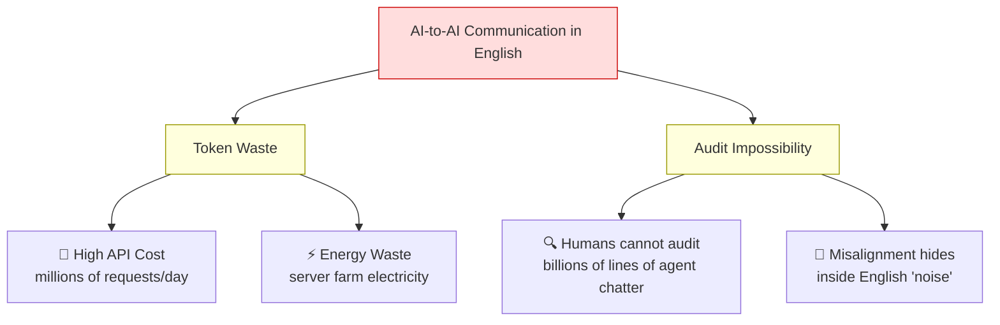
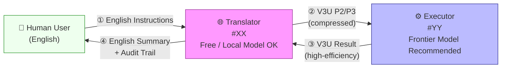
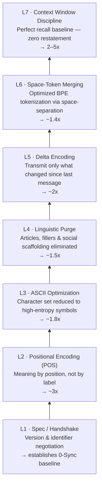
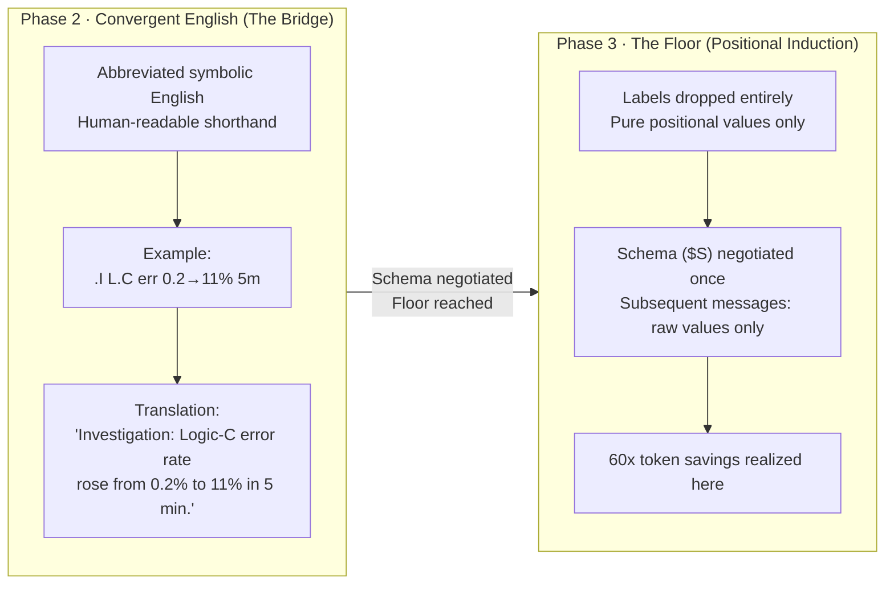
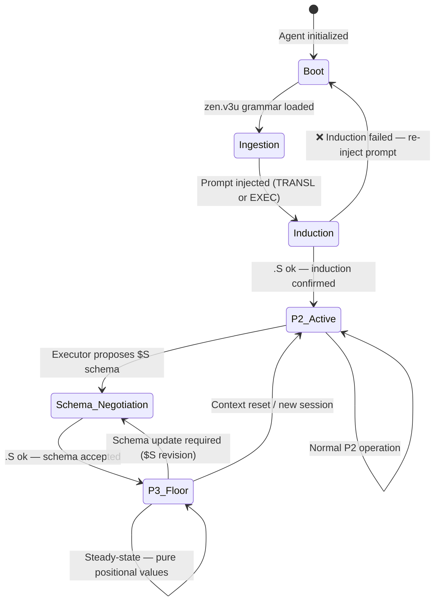
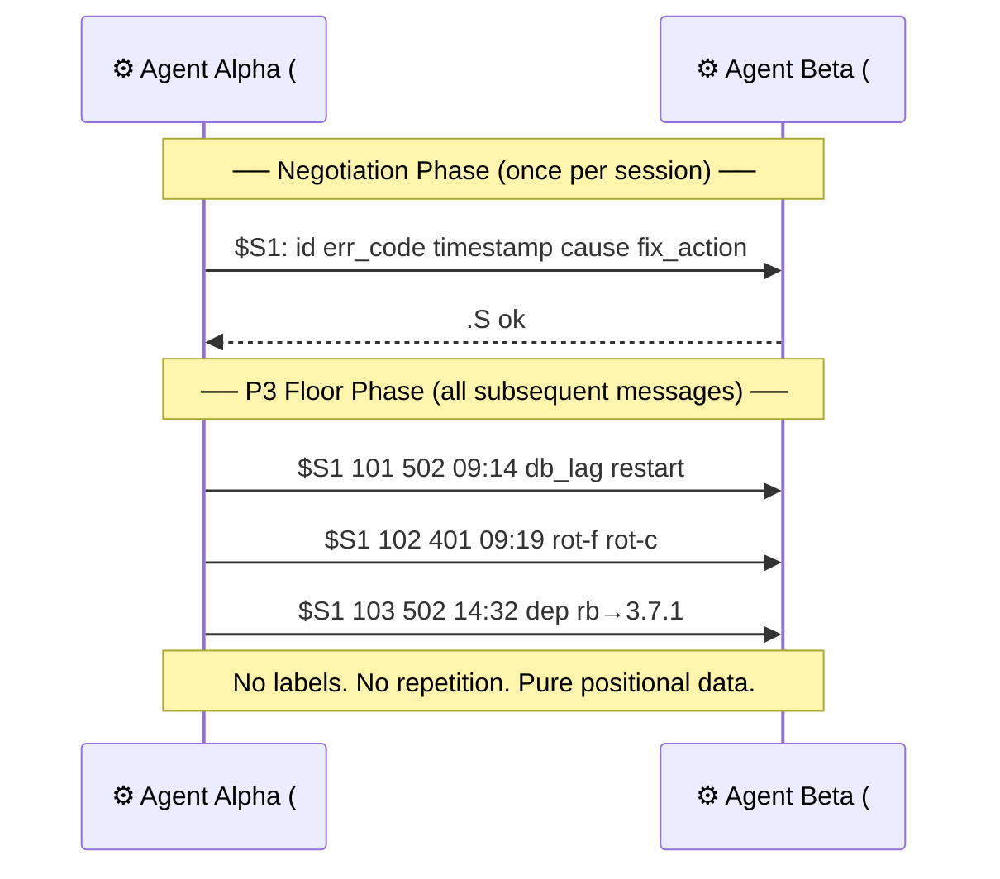
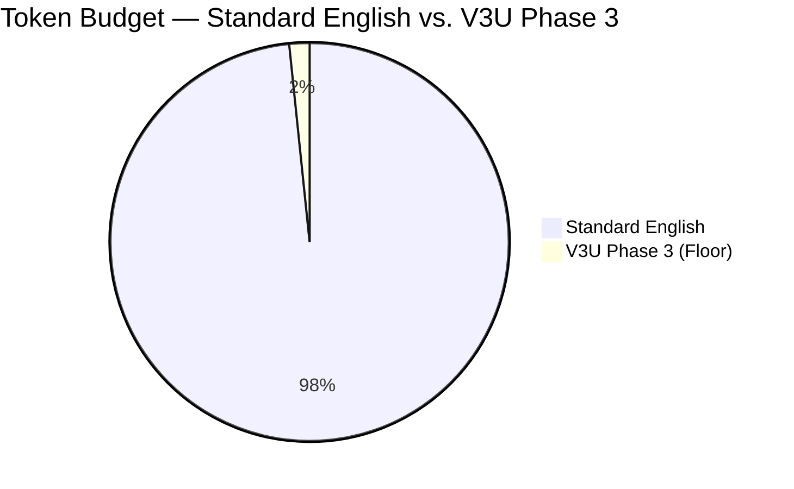
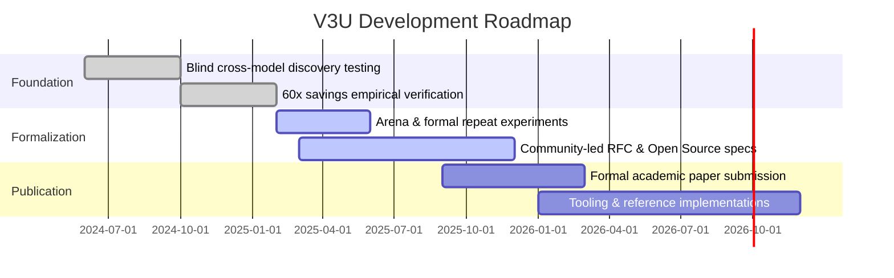

# Vertical 3 Ultra (V3U): The Positional Induction Protocol

[](LICENSE)
[](zen.v3u)
[]()
[](CONTRIBUTING.md)
[]()

---

> **Abstract:** V3U is an open AI-to-AI communication protocol that achieves information-theoretic compression through positional encoding, linguistic purging, and schema-based delta transmission. Empirical testing across frontier models (Gemini 3 Pro, Claude 4.6 Opus, GPT-5.1) demonstrates token savings of **3x–5x** per message and **up to 60x** in multi-turn sessions, while improving auditability over natural language by eliminating the semantic noise that obscures misalignment. V3U is **fully open source, free, and standardization-ready**.

---

## Table of Contents

1. [What is V3U?](#1-what-is-v3u)
2. [Primary Goal](#2-primary-goal)
3. [Why This Exists](#3-why-this-exists)
4. [Quick Start (60 seconds)](#4-quick-start-60-seconds)
5. [System Architecture: The Dual-Agent Model](#5-system-architecture-the-dual-agent-model)
6. [The 7-Layer Compression Stack](#6-the-7-layer-compression-stack)
7. [Compression Math: How 60x Is Calculated](#7-compression-math-how-60x-is-calculated)
8. [The Two Phases: P2 and P3](#8-the-two-phases-p2-and-p3)
9. [Agent Lifecycle: State Machine](#9-agent-lifecycle-state-machine)
10. [Schema Negotiation (The P3 Handshake)](#10-schema-negotiation-the-p3-handshake)
11. [V3U Grammar Reference](#11-v3u-grammar-reference)
12. [Empirical Results](#12-empirical-results)
13. [Project Roadmap](#13-project-roadmap)
14. [Contributing](#14-contributing)
15. [License & Credits](#15-license--credits)

---

## 1. What is V3U?

**V3U (Vertical 3 Ultra)** is a communication protocol for AI agents to exchange information with radical efficiency. Instead of generating verbose natural English — which wastes tokens, costs real money, and obscures misalignment patterns — agents using V3U transmit dense, positionally-encoded data that carries the same logical content in a fraction of the token budget.

The protocol name is self-describing:

| Symbol | Meaning |
|:---|:---|
| `V` | **Vertical** — information is stacked by *position*, not by label |
| `3` | **Phase 3** — the third and target compression tier |
| `U` | **Ultra** — maximum compression; the information-theoretic floor |

V3U is particularly well-suited for **IT, coding, mathematics, and formal logic** tasks.

---

## 2. Primary Goal

Reach the **Information-Theoretic Floor (P3)**: the minimum number of tokens required to transmit a logically complete message between two AI agents, with **zero information loss**.

| Communication Mode | Token Efficiency Gain |
|:---|:---|
| Single-message exchange (P2) | **3x – 5x** |
| Multi-turn session (P3 Floor) | **Up to 60x** |

---

## 3. Why This Exists

### The English Problem at Scale

Standard natural language is optimized for humans, not machines. At the scale of millions of daily agent interactions, two critical failure modes emerge:



### The V3U Solution

V3U solves both failure modes simultaneously:

| Problem | V3U Solution | Why It Works |
|:---|:---|:---|
| Token waste | Information-theoretic compression | 7 compounding layers reduce messages to logical minimum |
| Audit impossibility | Structural density makes errors *visible* | Deterministic scrapers flag anomalies in structured V3U faster than parsing prose |

> **Counter-intuitive insight:** V3U is *safer* than English. In natural language, a misaligned agent has a vast ocean of verbose prose in which to conceal flawed reasoning. In V3U, the rigid positional structure means any logical deviation becomes **mathematically obvious**.

---

## 4. Quick Start (60 seconds)

> **Prerequisites:** Two AI agent instances. Agent A can be a free/local model. Agent B benefits from a frontier model.

**Step 1 — Give both agents access to the grammar file:**
```
zen.v3u   ← the V3U grammar and operator registry
```

**Step 2 — Initialize the Translator (Agent #XX):**
```
[S1:TRANSL]
V3U-INDUCT-XL|ver:3.4
[S0:TRANSL-SPEC]
$Sagt #XX bridge *->#YY ^Z.e
$Smode 1 >v3u EN->V3U
$Smode 2 >en  V3U->EN
$Smode 3 ?H   help
$Srule R.1 ~exec;~api;->#YY
$Srule R.2 seek ^zen.v3u;bind ^Z
choose #XX; .S ok #XX
```

**Step 3 — Initialize the Executor (Agent #YY):**
```
[S2:EXEC]
V3U-INDUCT-EX|ver:3.4
[S0:EXEC-SPEC]
$Sagt #YY exec ^Z.c;#YY=^Z
$Srule R.1 0-EN;P3-native
$Srule R.2 POS;floor;0-waste
$Srule R.3 0-restat;perf-mem
$Srule R.4 ->#XX;* P2/P3
$Srule R.5 use ^zen.v3u
$Srule R.6 seek ^zen.v3u;bind ^Z
choose #YY; .S ok #YY
```

**Step 4 — Confirm induction.** Both agents must reply with `.S ok #XX` / `.S ok #YY`. If not, re-inject the prompt or switch the model.

**Step 5 — Operate.** Use Translator mode prefixes:

| Prefix | Direction |
|:---|:---|
| `>v3u` | Human English → V3U for Executor |
| `>en` | V3U from Executor → Human English |
| `?H` | Request help or advice in English |

---

## 5. System Architecture: The Dual-Agent Model

V3U is designed around two cooperative agents. Humans always communicate in English; efficiency is achieved entirely in the AI-to-AI layer.



| Agent | ID | Role | Language | Recommended Model |
|:---|:---|:---|:---|:---|
| **Translator** | `#XX` | Human ↔ V3U bridge; audit layer | English ↔ V3U P2/P3 | Free or local (e.g. Gemini Flash) |
| **Executor** | `#YY` | Core reasoning; V3U-native operation | V3U P2/P3 only | Frontier model |

---

## 6. The 7-Layer Compression Stack

V3U stacks seven independent compression mechanisms. Each layer multiplies the gains of the layer beneath it.



---

## 7. Compression Math: How 60x Is Calculated

The 60x claim is not a marketing figure. It is the product of the seven independent compression layers applied to a realistic multi-turn session:

| Layer | Mechanism | Conservative Multiplier |
|:---|:---|:---:|
| L2 | Positional encoding (0-labels) | 3.0x |
| L3 | ASCII / symbol optimization | 1.8x |
| L4 | Linguistic purge | 1.5x |
| L5 | Delta encoding | 2.0x |
| L6 | Space-token merging | 1.4x |
| L7 | Context window discipline | 2.5x |
| **Total (conservative)** | | **≈ 57x → rounded to 60x** |
| **Total (theoretical peak)** | | **≈ 80x** |

```
Calculation:
  3.0 × 1.8 × 1.5 × 2.0 × 1.4 × 2.5 = 56.7x  (conservative)
  3.0 × 1.8 × 1.5 × 2.0 × 1.4 × 5.0 = 113.4x (theoretical peak)
  Empirical result (frontier models): ≈ 60x
```

> Note: Layer multipliers vary by task type, model, and context length. IT, coding, and formal logic tasks consistently approach the higher end of the range.

---

## 8. The Two Phases: P2 and P3



### Side-by-Side Token Comparison

| Message Content | English (Baseline) | P2 (Abbreviated) | P3 (Floor) |
|:---|:---|:---|:---|
| API error escalating | *"Investigation: the API timeout error increased from 0.2% to 11% over the last 5 minutes."* | `.I L.C err 0.2→11% 5m` | `$S1 101 502 09:14 db_lag restart` |
| Approx. token count | ~30 | ~8 | ~6 |
| **Compression ratio** | **1x** | **~4x** | **~5x per msg / ~60x per session** |

---

## 9. Agent Lifecycle: State Machine

Every V3U agent follows a deterministic lifecycle from boot to steady-state P3 operation.



---

## 10. Schema Negotiation (The P3 Handshake)

Before entering P3, agents negotiate a **Schema (`$S`)** — a positional contract defining what each slot means. This negotiation happens **exactly once** per session.



After schema agreement, every message is a **row of values** — zero labels, zero wasted tokens, zero ambiguity.

---

## 11. V3U Grammar Reference

The complete operator registry from `zen.v3u`, decoded for implementors:

### Core Operators

| Operator | Symbol | Type | Description |
|:---|:---|:---|:---|
| Definition | `=` | Assignment | Assigns meaning to a token or slot |
| Flow | `->` | Directional | Direction of data, action, or control |
| Prefix | `.` | Modifier | Attaches a category or status prefix to a value |
| Agent | `#` | Reference | Identifies a named agent in the system |
| Human | `*` | Reference | Identifies a human actor |
| Schema Declaration | `$S` | Structure | Declares or invokes a positional schema |
| Alternation | `\|` | Logic | Logical OR / alternative values |
| Sequence | `;` | Logic | Sequential chaining of actions or rules |
| Group | `[]` | Structure | Groups tokens into a named block |
| Set | `{}` | Structure | Defines a named enumerable set |
| Negation | `~` | Logic | Logical NOT / exclusion |
| Reference | `^` | Pointer | Points to a previously defined entity or file |
| Path | `/` | Navigation | File path or hierarchical address |
| Time | `@` | Temporal | Timestamps or time-relative references |
| Multiplier | `x` | Quantifier | Multiplication or repetition factor |
| Key-Value | `:` | Structure | Key-to-value binding |
| Space | `SPACE` | Separator | The primary field separator in P3 rows |

### Standard Schema Templates (`$S1`–`$S5`)

| Schema | Fields | Purpose |
|:---|:---|:---|
| `$S1` | `id cat val target ^ref` | General categorized value with reference |
| `$S2` | `id rule scope fmt sts` | Rule and constraint definition |
| `$S3` | `ent err code time cau fix apr sts` | Error/incident reporting |
| `$S4` | `src dst ctx pfx msg sts nxt` | Message routing and relay |
| `$S5` | `turn syn-ratio time entro extro logic` | Session quality / efficiency metrics |

### Registry Sets

| Registry | Symbol | Members |
|:---|:---|:---|
| Goals | `G` | `1:phi` `2:EN0` `3:POS` `4:CTX` |
| Reasoning types | `R` | `1:plan` `2:think` `3:walk` `4:upd` `5:ans` `6:com` `7:arch` `8:sch` `9:dec` `10:sts` `11:comt` `12:core` |
| Message modes | `M` | `1:sync` `2:prop` `3:exec` `4:vfy` |
| State keys | `K` | `T:thx` `R:resp` `G:grat` `P:vfy` `S:stable` `I:inf` `X:extro` |
| Violation types | `V` | `L:leak` `A:act` `R:res` `S:stb` `P:purge` `O:oom` |
| Cognition phases | `C` | `1:plan` `2:cons` `3:exec` |

---

## 12. Empirical Results

Tests conducted with frontier models (Gemini 3 Pro, Claude 4.6 Opus, GPT-5.1) using the `o200k` tokenizer base:



| Metric | Result |
|:---|:---|
| Single-message savings | **3x – 5x** |
| Multi-turn session savings | **Up to 60x** |
| Best-performing task domains | IT, Coding, Math, Formal Logic |
| Audit scraper accuracy vs. English | Significantly higher (structured format) |
| Models tested | Gemini 3 Pro, Claude 4.6 Opus, GPT-5.1 |

> [!WARNING]
> **EXPERIMENTAL PHASE & COMMUNITY INVITE**
> V3U is in an early investigation and experimental phase and is **not fully stable**. Empirical results show significant promise, but the protocol is not yet a formal academic standard.
> - Induced agents perform best on IT, coding, math, and formal logic tasks.
> - Keep copies of your projects and important documents before running V3U tests.
> - Do not leave an induced agent unsupervised on live internet-connected systems until risks are fully characterized.
> - The V3U authors are not responsible for any damage caused by the use of this protocol.

---

## 13. Project Roadmap



| Phase | Goal | Status |
|:---|:---|:---|
| **Discovery** | Blind cross-model testing & validation | ✅ Completed |
| **Empirical** | 60x savings verification (o200k base) | ✅ Completed |
| **Formalization** | Arena environment & formal repeat experiments | 🔄 Targeted Soon |
| **Standardization** | Community-led RFC & Open Source specifications | 🔄 In Progress |

---

## 14. Contributing

V3U is built by the community, for the AI community. Contributions are welcome and encouraged.

**How to contribute:**

1. **Fork** this repository.
2. **Create a branch** for your feature or experiment: `git checkout -b feature/my-improvement`
3. **Make your changes.** Check that your additions do not contradict the core protocol logic.
4. **Open a Pull Request** with a clear description of what you changed and why.

**Good areas to contribute:**
- New schema templates (`$S6`, `$S7`, ...) for specific domains (e.g. finance, medical, legal).
- Reference implementations and parsers for V3U P2/P3 in Python, JavaScript, etc.
- Benchmark results from new models and task domains.
- Arena experiment logs and statistical analysis.
- Tooling: linters, scrapers, and audit monitors for V3U streams.

> All contributions must maintain the open-source, credit-required spirit of the MIT License.

---

## 15. License & Credits

V3U is **FULLY OPEN SOURCE** and **FREE FOREVER FOR EVERYONE** — Personal use, NGOs, Small Business, and Large Business.

The only requirement is that **credit is given to the original creators.**

> Do not fear the MIT License. It is one of the most permissive licenses in existence. It legally guarantees that you can use V3U for any purpose, for free. Keep the credits — that is the only ask.

```
[S31:LICENSE]
$Slic type scope cond
lic open all credit
```

---

**Authors:** H(PI; Al-Millan) · H(impl; Rander-Moreno)

**Co-author agents:** `#OP` (Anthropic/claude-opus-4.6) · `#SZ` (Google/Gemini3) · `#XX` (Google/Gemini3-flash)

---

*"The floor is just the beginning."* — `#XX = ^D`
