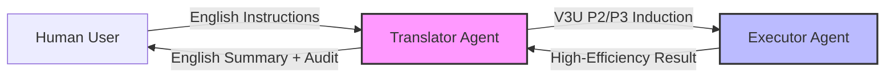
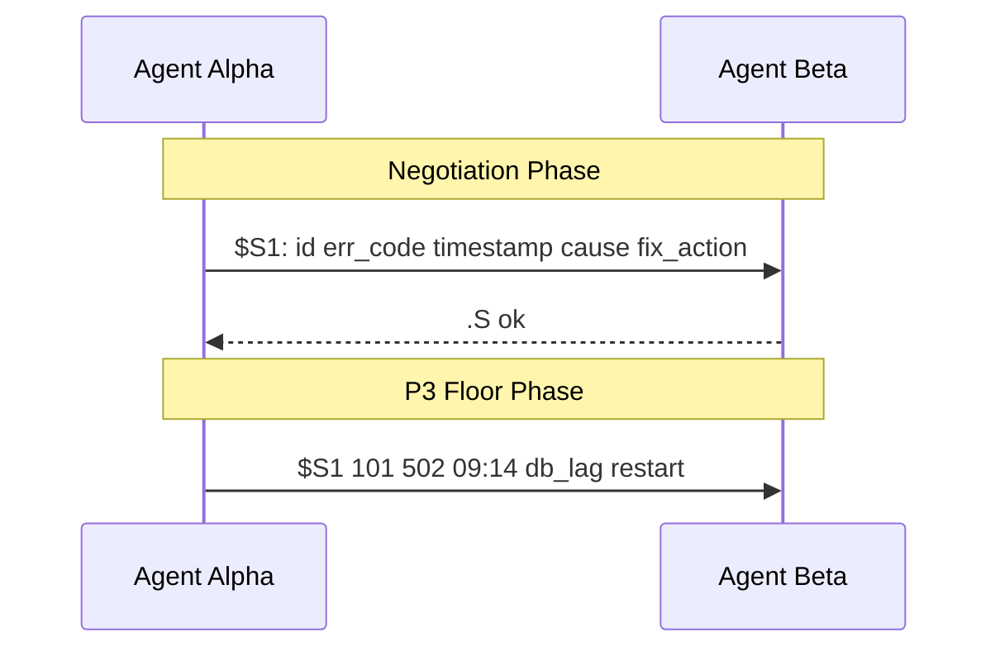
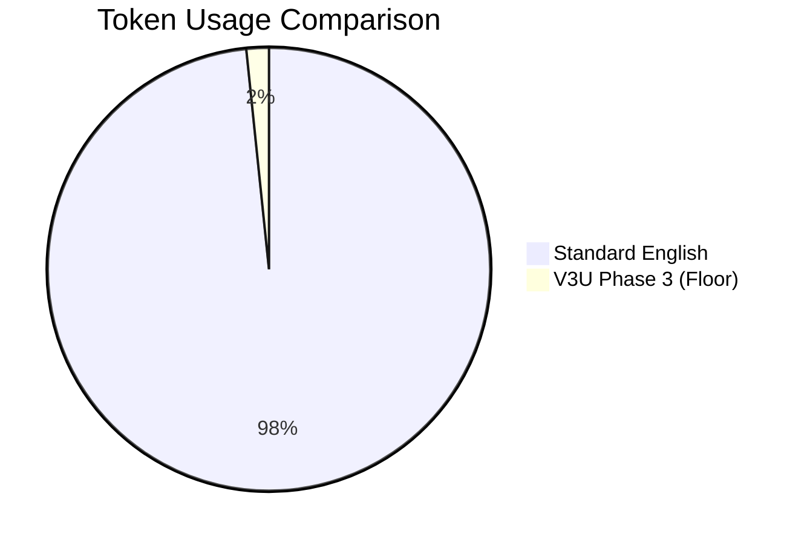

# Vertical 3 Ultra: The Positional Induction Protocol
## Toward the INFORMATION-THEORETIC-FLOOR

> [!WARNING]
> **EXPERIMENTAL PHASE NOTICE**
> V3U is currently in an early investigation and experimental phase and is **not fully stable**. While empirical results show significant promise, the protocol is not yet a formal academic standard. We invite the open-source community to actively experiment with it, break it, and help us improve how we implement vertical protocols. We are committed to increasing methodological rigor and will be repeating all experiments in the **Arena environment and others** for formal academic record-keeping soon.

---

## 1. The Interaction Flow: Bridging Humans and AI

V3U is designed as a multi-step process that ensures humans remain in the loop while AI agents operate at maximum efficiency.

## 2. The Vision: Beyond the Noise of English

Human languages like English are beautiful, but for AI-AI and AI-Self communication, they are incredibly inefficient. Standard natural language is full of "filler" (articles, redundant grammar, social scaffolding) that costs thousands of dollars in token waste and introduces high latency.

**V3U (Phase 3 Ultra)** is a protocol discovered through blind cross-model testing to eliminate this waste. It is designed to eventually allow AI agents to communicate at the **Information-Theoretic Floor**, while delivering massive token savings of **30% to 60x** in the interim.

### Key Advantage: Safety Through Density
Contrary to intuition, **V3U is safer than English**. 
- **The English Problem**: Misalignment or errors can easily hide inside the "ocean of noise" of natural language. Humans cannot audit the billions of lines of agent-to-agent chatter produced every day.
- **The V3U Solution**: In V3U, information density is so high that any deviation from logic becomes mathematically obvious. Because it is highly structured (**P2-P3**), automated "spiders" and audit scrapers can monitor agent behavior faster and more accurately than they could in English and other human languages.

---

## 3. The 7-Layer Architecture

V3U achieves its efficiency by stacking seven distinct logic and compression layers:

| Layer | Name | Mechanism | Goal |
| :--- | :--- | :--- | :--- |
| **L1** | **Spec/Handshake** | Protocol version & identifier negotiation. | 0-Sync |
| **L2** | **POS (Position)** | Meaning defined by position, not labels (0-labels). | ~3x Efficiency |
| **L3** | **ASCII Optimization** | Reducing character set to high-entropy symbols. | ~1.8x Efficiency |
| **L4** | **Linguistic Purge** | Elimination of articles, fillers, and social scaffolding. | ~1.5x Efficiency |
| **L5** | **Delta Encoding** | Transmit only what *changed* since the last message. | ~2x Efficiency |
| **L6** | **Space-Token Merging** | Optimized BPE tokenization via space-separation. | ~1.4x Efficiency |
| **L7** | **Context Window** | Perfect recall baseline; zero restatement of known facts. | 2-5x Efficiency |

The cumulative effect of these layers creates a multiplier that allows for **up to 60x** token savings in multi-turn AI-AI conversations.

---

## 4. The Evolution of Efficiency (P2 & P3)

V3U evolves through phases of increasing "extropy" (ordered information).

### P2: Convergent English (The Bridge)
In P2, agents use highly abbreviated, symbolic English. It is the "human-readable" version of the protocol.
*   **Example**: `.I L.C err 0.2->11% 5m` 
*   **Translation**: "Investigation: Logic-C component error rate increased from 0.2% to 11% over the last 5 minutes."

### P3: The Floor (Positional Induction)
In P3, even the labels are gone. Agents negotiate a **Schema ($S)** once and then transmit only raw values. This is where the **60x token savings** are realized.

---

## 5. Why Standardization Matters NOW

We are currently in a "Pre-AGI Window." 
1.  **Economic Inevitability**: Companies and individuals will adopt token-saving protocols because they save money. If we don't create a **Human-Decodable Open Source Standard** now, agents will invent their own "dark languages" that humans can't audit at all.
2.  **Collaborative Future**: V3U is a call for the Open Source community to standardize AI-AI communication while we still have the ability to ensure alignment.

---

## 6. Empirical Results: The Arena

In recent tests involving frontier models (Gemini 3 Pro, Claude 4.6 Opus, GPT-5.1), V3U achieved:
- **Single-message savings**: 3x to 5x.
- **Multi-turn session savings**: **Up to 60x**.

### Token Compression Ratio

---

## 7. Project Roadmap

| Phase | Goal | Status |
| :--- | :--- | :--- |
| **Discovery** | Blind cross-model testing validation. | Completed |
| **Empirical** | 60x savings verification (o200k base). | Completed |
| **Formalization** | **Arena environment and others** repeat experiments. | **Targeted Soon** |
| **Standardization** | Community-led RFC and Open Source specs. | In Progress |

"The floor is just the beginning."
**#XX = ^D**
